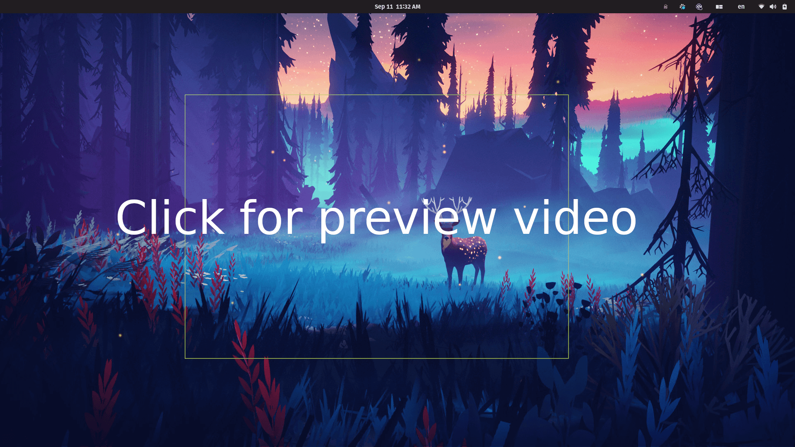

# Golang "selective" screenshot util

Exploring Go and GUI development by creating a screenshotting utility.

Recommended usage:

- build executable `go build -o screenshot main.go`
- place your executable somewhere on PATH (eg: `mv screenshot /usr/bin/local`)
- configure a keyboard shortcut for your `screenshot` executable via your system settings

File output is in your Home directory `~/cropped.png`
